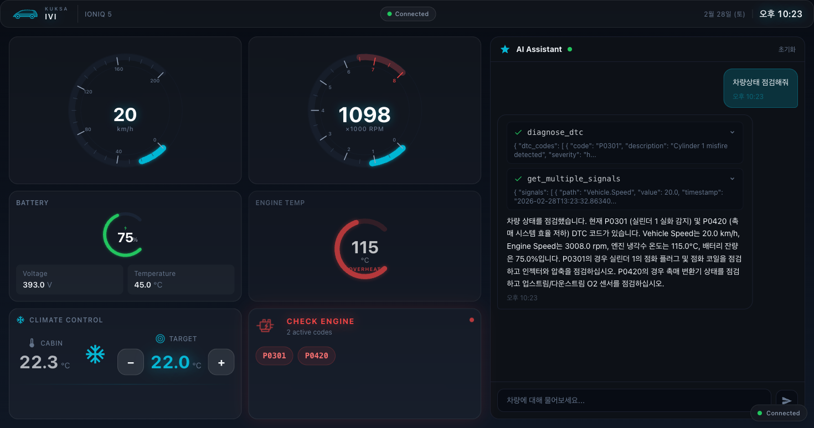
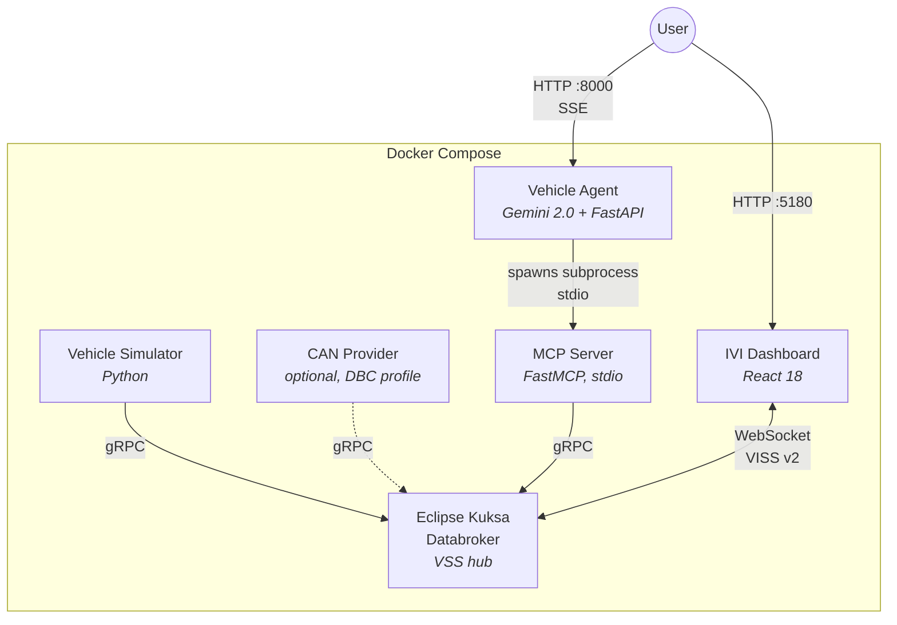
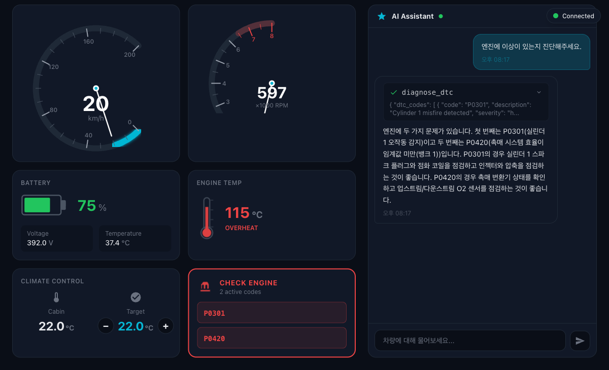
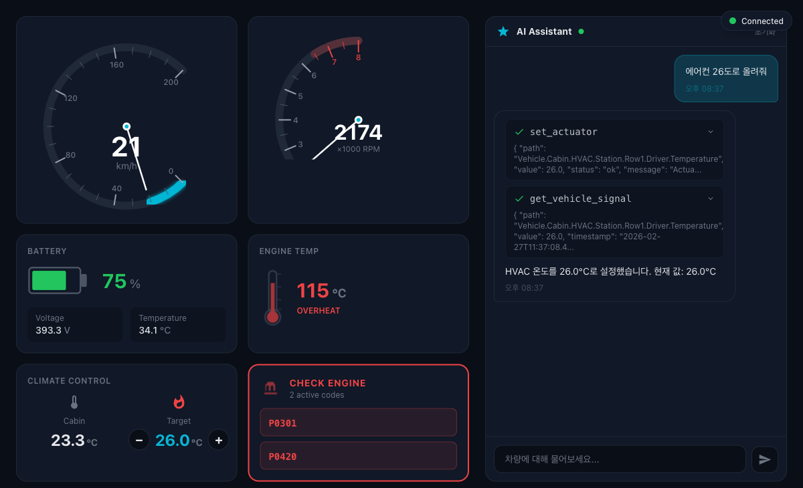
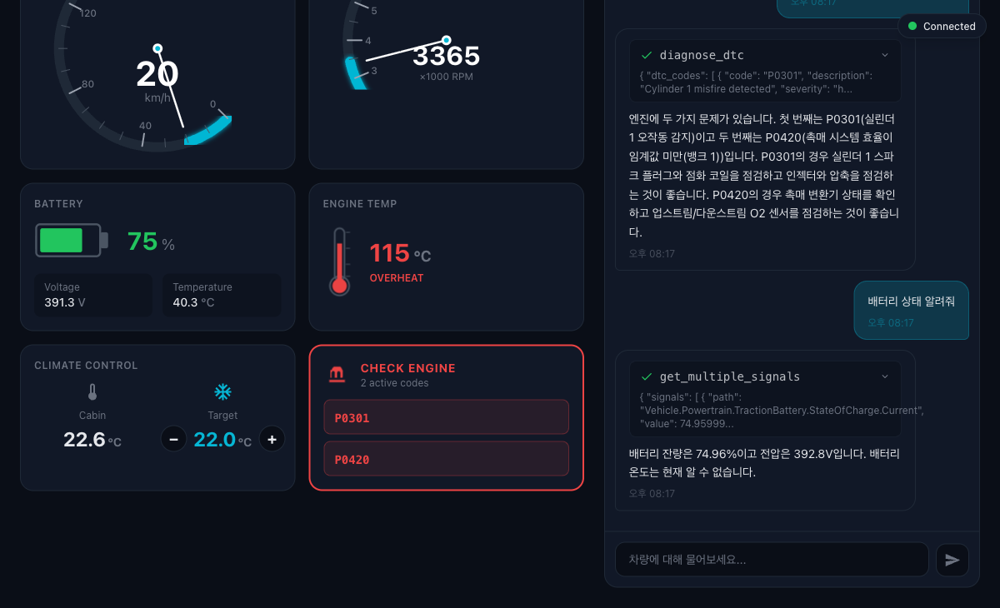

# kuksa-mcp-bridge


**AI-powered vehicle data bridge connecting Eclipse Kuksa (VSS) to the Model Context Protocol**

Eclipse Kuksa(VSS) 차량 데이터를 AI가 자연어로 조회·제어·진단할 수 있는 MCP 브릿지 + IVI 대시보드

<p align="center">
  
</p>

---

## Why This Project

- **The Gap** -- COVESA VSS defines 4,000+ vehicle signals. Eclipse Kuksa implements them. MCP connects AI to tools. But no bridge existed between VSS/Kuksa and MCP -- until now.
- **What It Does** -- Any MCP-compatible AI assistant can query vehicle speed, diagnose engine faults, control HVAC -- all through natural language.
- **Zero-Code Vehicle Swap** -- Swap a DBC file to switch from Hyundai to Tesla. The MCP server code stays identical.

---

## Architecture



---

## Quick Start

```bash
git clone https://github.com/YOUR_USERNAME/kuksa-mcp-bridge.git
cd kuksa-mcp-bridge
cp .env.example .env   # Add your GEMINI_API_KEY
docker compose up -d
```

| Endpoint | URL |
|----------|-----|
| IVI Dashboard | [http://localhost:5180](http://localhost:5180) |
| Agent API | [http://localhost:8000](http://localhost:8000) |
| Kuksa Databroker (gRPC) | `localhost:55556` |
| Kuksa Databroker (WebSocket) | `ws://localhost:8090` |

---

## Demo Scenarios

| Mode | Config | What It Demonstrates |
|------|--------|---------------------|
| Engine Warning | `SIM_MODE=engine_warning` | DTC diagnosis (P0301, P0420), ECT spike analysis |
| Normal Driving | `SIM_MODE=normal_driving` | Real-time dashboard, speed/RPM gauges |
| Battery Low | `SIM_MODE=battery_low` | SOC drain monitoring, voltage alerts |
| DBC Swap | `--profile dbc-feeder` | Zero-code vehicle swap (Hyundai <-> Tesla) |

```bash
# Engine warning demo (default)
./scripts/demo.sh mode1

# DBC vehicle swap demo
./scripts/demo.sh mode2

# Normal driving UI showcase
./scripts/demo.sh mode3
```

---

## MCP Interface

### Tools (6)

| Tool | Description | Returns |
|------|-------------|---------|
| `get_vehicle_signal` | Query a single VSS signal | `{path, value, unit, timestamp, status}` |
| `get_multiple_signals` | Batch query multiple signals | `{signals[], count, status}` |
| `set_actuator` | Control vehicle actuators (HVAC, etc.) | `{path, value, status, message}` |
| `diagnose_dtc` | Read DTCs with human-readable diagnostics | `{dtc_codes[], count, status}` |
| `search_vss_tree` | Search VSS catalog by keyword | `{results[], count, status}` |
| `subscribe_signals` | Monitor signal trends over time | `{updates[], duration, status}` |

### Resources (3)

| URI | Description | MIME |
|-----|-------------|------|
| `vss://tree` | Complete VSS signal tree | `text/plain` |
| `vss://metadata/{path}` | Signal metadata (type, unit, range) | `application/json` |
| `vss://dtc-database` | DTC code reference database | `text/plain` |

### Prompts (3)

| Prompt | Description |
|--------|-------------|
| `vehicle_health_check` | Comprehensive vehicle status assessment |
| `driving_analysis` | Driving pattern analysis + efficiency tips |
| `diagnose_symptom` | Symptom-based fault diagnosis |

---

## Project Structure

```
kuksa-mcp-bridge/
├── mcp-server/              # Core: Kuksa gRPC --> MCP bridge
│   └── src/kuksa_mcp/       #   server, tools, resources, prompts, kuksa_client
├── simulator/               # Vehicle data generator (6 signal groups)
│   └── src/vehicle_sim/     #   engine, vehicle, hvac, battery, dtc, scenarios
├── agent/                   # Gemini AI agent + MCP client
│   └── src/vehicle_agent/   #   FastAPI, MCP bridge, ReAct loop
├── dashboard/               # React 18 IVI dashboard
│   └── src/                 #   Components, hooks, VISS WebSocket client
├── dbc/                     # DBC files + CAN-to-VSS mappings
│   ├── hyundai_kia/         #   Hyundai/Kia profile
│   └── tesla_model3/        #   Tesla Model 3 profile
├── infra/                   # Databroker Dockerfile + VSS metadata
├── docs/                    # Architecture, MCP design, demo scenarios
├── scripts/                 # Demo automation (demo.sh)
├── docker-compose.yml       # One-click deployment (6 services)
└── .env.example             # Environment variable template
```

---

## Tech Stack

| Layer | Technology |
|-------|-----------|
| MCP Server | Python 3.11 -- FastMCP (mcp SDK) -- kuksa-client -- gRPC |
| Simulator | Python 3.11 -- kuksa-client -- asyncio |
| AI Agent | Python 3.11 -- Google Gemini 2.0 Flash -- FastAPI -- SSE |
| Dashboard | React 18 -- TypeScript -- Vite -- Tailwind CSS -- Recharts |
| Infrastructure | Docker Compose -- Eclipse Kuksa Databroker -- VISS v2 |
| DBC Feeder | kuksa-can-provider -- opendbc (MIT) -- candump replay |
| Testing | pytest -- pytest-asyncio -- Vitest |

---

## Screenshots

<table>
  <tr>
    <td align="center"><b>IVI Dashboard</b></td>
    <td align="center"><b>Engine Diagnosis Chat</b></td>
  </tr>
  <tr>
    <td></td>
    <td></td>
  </tr>
  <tr>
    <td align="center"><b>HVAC Control Demo</b></td>
    <td align="center"><b>Battery Status Query</b></td>
  </tr>
  <tr>
    <td></td>
    <td></td>
  </tr>
</table>

---

## Testing

```bash
# MCP Server unit + integration tests
cd mcp-server && uv run pytest -v

# Simulator tests
cd simulator && uv run pytest -v

# Agent tests
cd agent && uv run pytest -v

# Dashboard unit tests
cd dashboard && npm run test

# Dashboard type check
cd dashboard && npx tsc --noEmit
```

---

## Environment Variables

Copy `.env.example` to `.env` and configure:

| Variable | Default | Description |
|----------|---------|-------------|
| `GEMINI_API_KEY` | *(required)* | Google Gemini API key for the AI agent |
| `SIM_MODE` | `normal_driving` | Simulator scenario: `normal_driving`, `engine_warning`, `battery_low` |
| `SIM_UPDATE_INTERVAL_MS` | `500` | Signal publish interval in milliseconds |
| `KUKSA_DATABROKER_HOST` | `databroker` | Kuksa Databroker hostname |
| `KUKSA_DATABROKER_PORT` | `55555` | Kuksa Databroker gRPC port |
| `VEHICLE_PROFILE` | `hyundai_kia` | DBC profile for CAN provider: `hyundai_kia`, `tesla_model3` |

---

## License

[Apache License 2.0](LICENSE)

---

## Acknowledgments

- [Eclipse Kuksa](https://github.com/eclipse-kuksa) -- VSS Databroker
- [COVESA VSS](https://github.com/COVESA/vehicle_signal_specification) -- Vehicle Signal Specification
- [commaai/opendbc](https://github.com/commaai/opendbc) -- Open DBC files
- [Model Context Protocol](https://modelcontextprotocol.io) -- AI-tool integration standard
